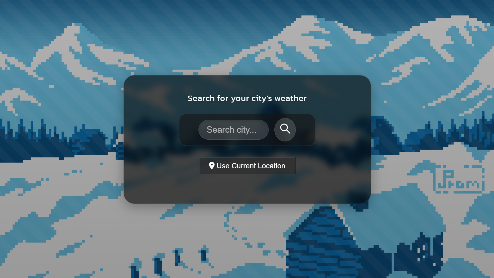
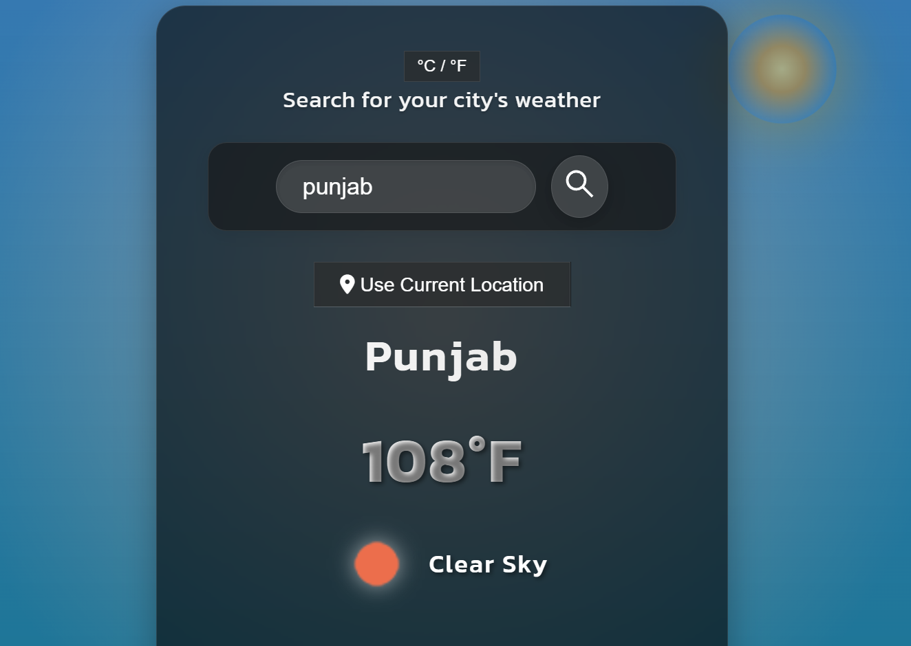

# Weather App

A weather application that shows current weather conditions, forecast, and air quality data for any city. The app features a responsive design with dynamic backgrounds that change based on weather conditions.

## Screenshots

    
    

## Features

- Current weather conditions
- 4-day forecast
- Air quality information
- Dynamic backgrounds based on weather
- Unit toggle (°C/°F)
- Geolocation support
- Responsive design for all devices

## Technologies Used

- HTML5
- CSS3
- JavaScript (Vanilla)
- OpenWeatherMap API